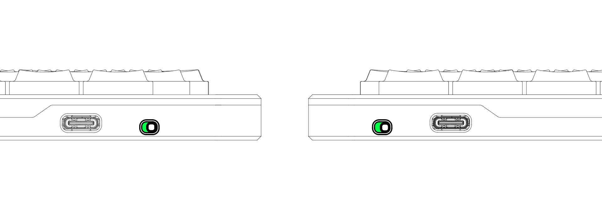
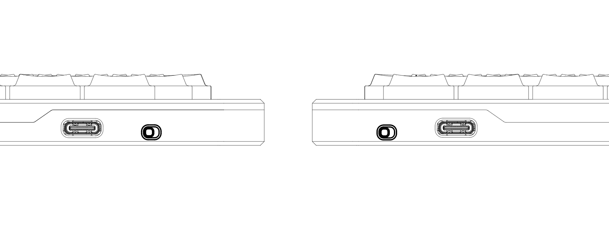
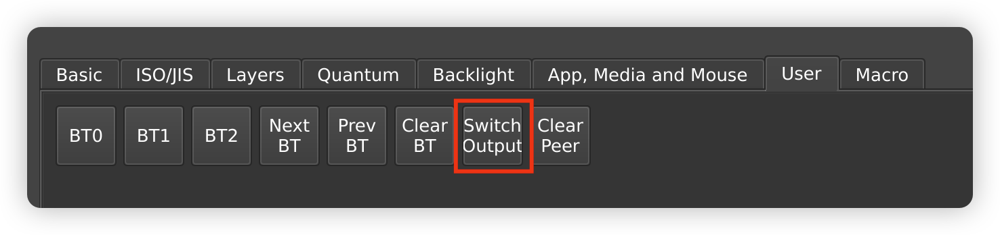
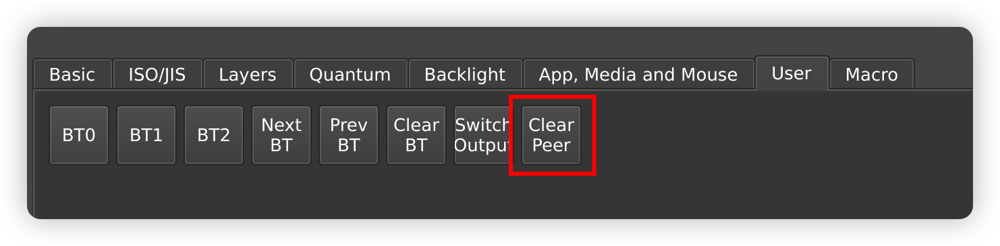
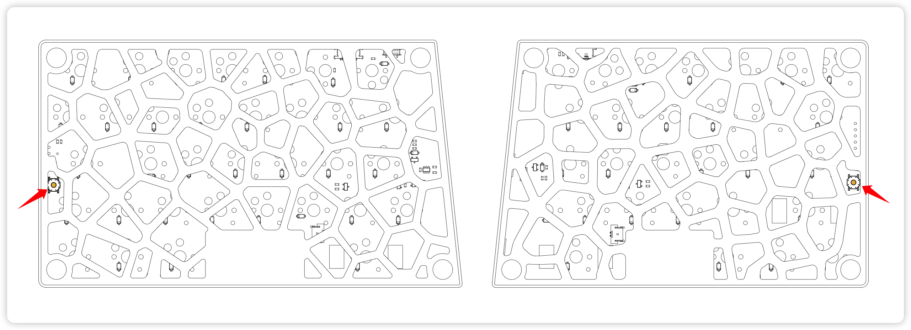
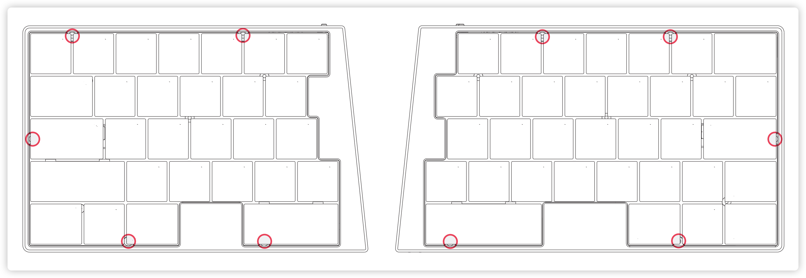
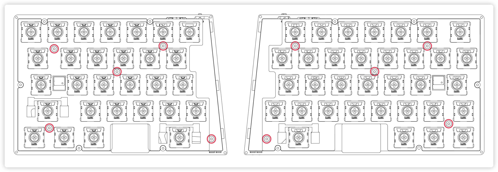

# Elytra User Manual

## ⚡️ Power On/Off

To turn the keyboard on or off, use the toggle located on the side of each unit.
- Turn ON: Slide the toggle to the Right.

- Turn OFF: Slide the toggle to the Left.

(Note: Directions are based on looking directly at the toggle)

## 💡 Indicator Lights

### Left Hand (Central):

The right light indicates the Bluetooth connection status, the left light indicates the battery level and peripheral connection status

| Light Position | Color          | Behavior     | Meaning                                        |
| -------------- | -------------- | ------------ | ---------------------------------------------- |
| Right          | 🟢 / 🔵 / 🔴 | Breathing    | Bluetooth profile 1/2/3 is waiting for pairing |
| Right          | 🟢 / 🔵 / 🔴 | Solid -> Off | Bluetooth profile 1/2/3 connects successfully  |
| Left           | 🔴          | Blinking     | Low battery                                    |
| Left           | 🟢          | Breathing    | Charging                                       |
| Left           | 🔵          | Breathing    | Searching for Right Hand (Peripheral)          |

### Right Hand (Peripheral):

The right light indicates the central connection status, the left light indicates the battery level.

| Light Position | Color | Behavior  | Meaning                           |
| -------------- | ----- | --------- | --------------------------------- |
| Right          | 🔵    | Breathing | Searching for Left Hand (Central) |
| Left           | 🔴    | Blinking  | Low battery                       |
| Left           | 🟢    | Breathing | Charging                          |

## 🛜 Connectivity

### USB Connection (Wired Mode)

1. Connect the USB data cable to the **Left Hand (Central)** only.
2. The USB port on the Right Hand is for **charging only** and does not transmit data.

### Bluetooth Connection

Elytra supports **up to 3 devices**.
- **Switching Devices:** Open [Vial](https://vial.rocks), go to the **User** tab, and assign keys to `BT0`, `BT1`, and `BT2`. Use these keys to switch between Bluetooth profiles.

### Connection Mode Switching

By default, Elytra is set to **USB Priority** mode. You can toggle modes via the **Switch Output** button in the Vial User tab.

- **USB Priority Mode (Default):**
  - If USB is plugged in: Keyboard communicates via USB.
  - If USB is unplugged: Automatically switches to Bluetooth.
- **Bluetooth Priority Mode:**
  - Bluetooth is always the primary connection.
  - Even if plugged in via USB, the cable will **only charge** the battery; keystrokes are sent via Bluetooth.

## ⌨️ Key Remapping

Elytra supports real-time key remapping via Vial:

1. Open **[vial.rocks](https://vial.rocks)** in a Chromium-based browser (Chrome, Edge)
2. Click **"Start Vial"** and select "Elytra" from the device list
3. Once connected, you can customize your layout instantly

> **Note:** Connection may occasionally fail due to signal interference. If this happens, refresh the page and retry.

## 💤 Sleep Mode

Elytra enters sleep mode automatically after a period of inactivity.

- **When Connected:** Bluetooth remains active. Waking up is instant (no keystrokes lost).
- **When Broadcasting (Not Connected):** The keyboard turns off radio activity. Press any alphanumeric key to wake it up and make it discoverable again.

## 🔗 Central & Peripheral Pairing

### Automatic Pairing (Out of the Box)

- The Left and Right units are pre-paired. They will automatically connect to each other when powered on. **No setup is required.**

### Unpairing (Resetting Connection)

Only perform this if you need to replace a unit or fix a connection issue between halves.

1. Open **Vial** and navigate to the **User** tab.

2. Assign the **Clear Peer** function to a key on your layout.

   

3. **Press and hold** the "Clear Peer" key for **8 seconds**.

4. **Power Cycle Required:**

   - Unplug the USB cable.
   - Turn off the power switch.
   - Wait 3 seconds, then turn it back on.

### Re-pairing

After unpairing and restarting, both units will enter "Search Mode" (Blue breathing light). They will automatically find each other and re-pair.

> **Tip:** If pairing multiple sets of keyboards, power on **only one pair at a time** to prevent cross-connection between different splits.

## Firmware Update

Follow these steps to update your keyboard firmware:

1. **Remove existing pairings**: "Forget" or remove the keyboard from the Bluetooth settings of all paired devices.
2. Locate the reset button on the bottom of your keyboard. There's one button on each side, positioned along the keyboard's edge.

3. Connect a USB cable to the **Right Hand (Peripheral)**, then double-click the reset button. A USB drive named "Elytra" will appear on your computer.
4. Drag and drop the **peripheral** firmware file onto the drive. Make sure you're using the correct firmware for each side—don't mix them up!
5. The USB drive will automatically disconnect once the update completes. **Note:** macOS may show an error message with code -36 when the keyboard reboots—you can safely ignore this.
6. Repeat steps 3-5 for the **Left Hand (Central)**, this time using the **central** firmware file.
7. All done! Your keyboard is now running the latest firmware.

## Insulation Pad Replacement

The keyboard ships with a hollow insulation pad installed by default (matching the shape of the bottom case), and a full (solid) insulation pad is included in the box. If you'd like to swap it out, follow these steps:

1. Pull off the keycaps at the positions shown in the image below and unscrew the screws underneath.

2. Separate the top case from the bottom case.
3. Unscrew the screws at the positions shown in the image below.

4. Take out the inner assembly of the keyboard and replace the insulation pad.
5. Reassemble the inner assembly and the top case, then refit the keycaps and screws.
